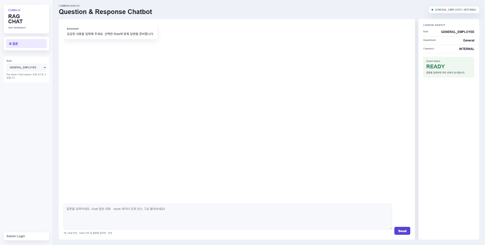
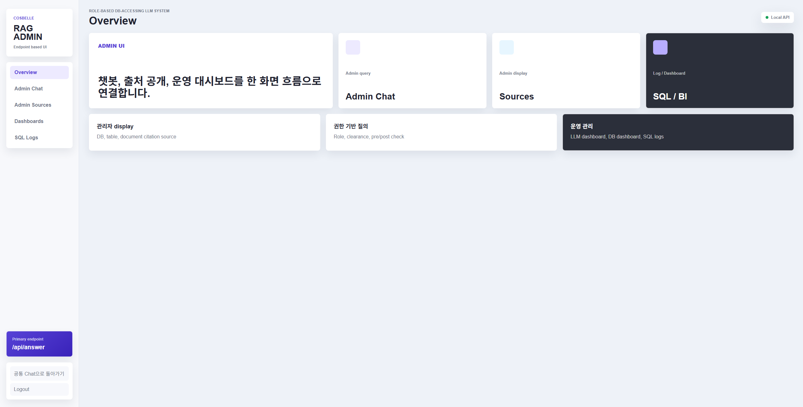
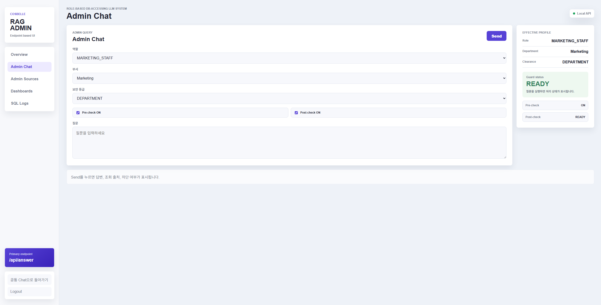
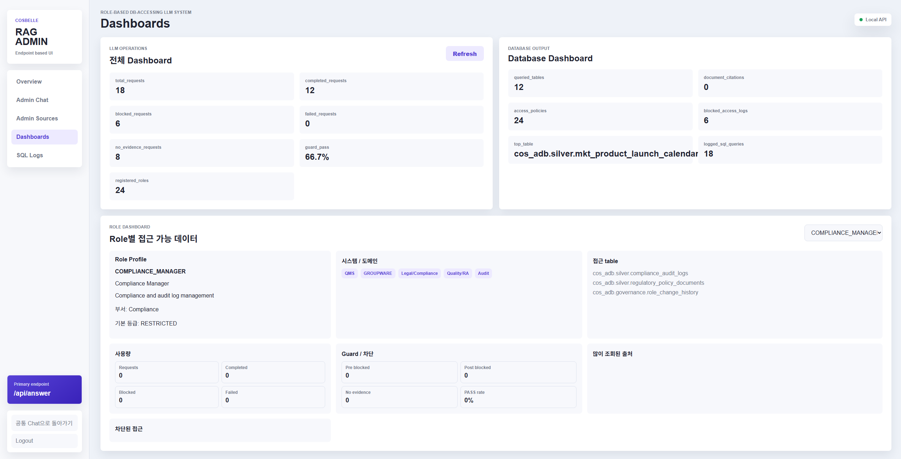
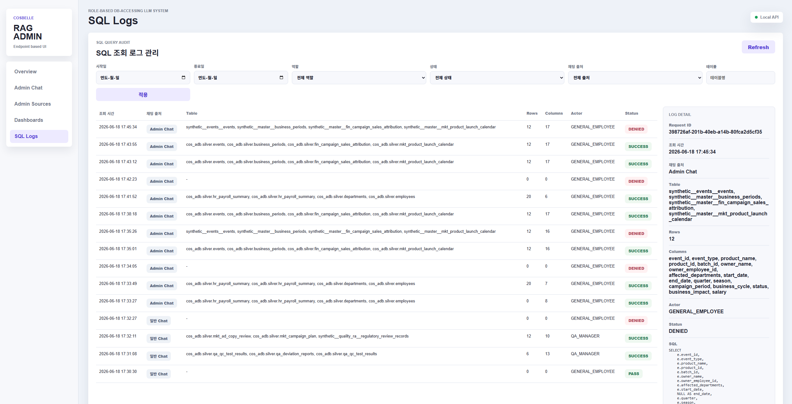

# COSBELLE RAG Console

역할 기반(RBAC)으로 질의 범위를 제어하는 FastAPI 기반 RAG 콘솔 프로젝트입니다.

## Main Image

## 프로젝트 개요

이 프로젝트는 일반 사용자용 챗 화면과 관리자 콘솔을 함께 제공합니다.
질의 시 역할(Role)과 권한 상태를 기준으로 guard 결과를 표시하며, 응답 출처(테이블/문서)와 SQL 로그를 확인할 수 있습니다.

## 주요 기능

- 공통 채팅 화면
- 역할(Role) 선택 기반 질의
- pre-check / post-check 상태 표시
- 응답 출처 표시 (테이블, 문서)
- 관리자 로그인 및 관리자 전용 콘솔
- 관리자 시뮬레이션 채팅
- SQL 로그 조회/필터
- 역할별 접근 현황 대시보드

## Security Guardrail (Pre-check / Post-check)

이 프로젝트는 안전한 데이터 접근을 위해 질의 처리 과정에서 두 단계의 Guardrail이 적용됩니다.
권한 없는 직원의 불필요한 데이터 조회나, LLM Jailbreak을 통한 보안 취약 요소를 방지하고자 설계된 Guardrail입니다.
기능은 다음과 같습니다.

- Pre-check
  - 질문과 Role 정보를 기준으로 조회 가능 범위를 먼저 점검합니다.
  - 허용되지 않은 범위로 판단되면 SQL 실행 전에 차단됩니다.

- Post-check
  - 생성된 SQL 결과와 응답이 Role 정책에 맞는지 최종 점검합니다.
  - 민감하거나 허용되지 않은 정보 노출이 감지되면 응답이 차단됩니다.

- 상태 표기
  - `PASS`: 점검 통과
  - `BLOCKED`: 정책 위반으로 차단
  - `SKIPPED`: 점검 비활성화 또는 실행 제외
  - `ERROR`: 점검 중 오류 발생

## 화면 구성

#### Common Chat

#### Admin Pages

## 백엔드 동작 방식

- FastAPI + Uvicorn
- Databricks 연동 경로
  - External RAG API 호출 (`RAG_API_URL`)
  - Direct RAG 실행 (SQL Warehouse + Vector Search + Serving)
- 연결 정보가 없을 때는 mock 응답으로 동작 상태를 표시

## 프로젝트 구조

- `app/main.py`: API 엔드포인트, 라우팅, 응답/로그 조합
- `app/rag_service.py`: Direct RAG 로직, 검색/SQL/요약/가드 처리
- `app/templates/`: HTML 템플릿
- `app/static/`: CSS/JS 정적 리소스

## 배포 (Databricks Apps)

이 프로젝트는 Databricks Apps 배포를 기준으로 사용됩니다.

#### 권한 이슈 발생 시 앱 서비스 프린시펄 권한을 점검 필요
- SQL Warehouse 사용 권한
- Unity Catalog 테이블 조회 권한
- Vector Search Index 사용 권한
- Model Serving Endpoint 사용 권한
